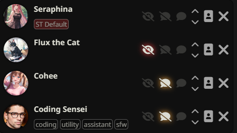

## Installation
Use ST's inbuilt extension installer with this URL:

`https://github.com/leandrojofre/SillyTavern-Presence`

## Usage
Just start chatting! It really is that simple!
Okay, but really here's how it works.
SillyTavern has two kinds of chats and this plugin works differently for both:

### Individual chats
If you're talking one on one with a character then this plugin will do nothing, nudda.
It simple disables itself if you are not in a group chat.

### Group chats
In a group chat this plugin will restrict each character's memory to what they were there for.
This is done by hiding all messages that they don't remember.
Each message will have a little icon for each character who was 'present' for that message.

You can control who is 'present' (i.e. who remembers things) by enabling or disabling automatic replies from that character.
Characters remember two things:

1. Messages they were present for.
2. The message directly before the one they are replying to, this is only short in short term memory while they are "typing" but moves to long term memory when their message actually gets sent.

You can also change who was present for a message after it is recieved, hover over the little icons that show who was present and they will expand and show an icon for everyone whether they were there or not. Just click an icon to change whether that character was present.

### The all seeing narrator
If you have a character who should see everything (such as a narrator) then can head to the character management panel where you'll find a new button next to each character.

Click this button and it lights up, that will indicate that this character can see EVERYTHING.

### Commands
- `/presenceForget name=<char_name> <mes_index|mes_range>` Removes **some** messages from the memory of a character.
- `/presenceForgetAll <char_name>` Wipes the memory of a character.
- `/presenceRemember name=<char_name> <mes_index|mes_range>` Adds **some** messages to the memory of a character.
- `/presenceRememberAll <char_name>` Adds **all** messages to the memory of a character.
- `/presenceReplace name=<char_name> replace=<char_name> forget=<true|false>? <mes_index|mes_range>?` Transfer or clone the messages from the memory of a character to another. `forget` is `true` by default, set it to `false` to just clone memmories.
- `/presenceForceNonePresent <mes_index|mes_range>?` Makes **all** characters forget **everything**.
- `/presenceForceAllPresent <mes_index|mes_range>?` Makes **all** characters remember **everything**.
- `/presenceCopy source_index=<mes_index> target_index=<mes_index>` Copies the Tracker of a message and pastes it on another one - it does not replace the original tracker.
- `/presenceLockHiddenMessages name=<char_name>? unlock=<true|false>? <mes_index|mes_range>?` Locks hidden messages in the chat. Locked messages won't be unhidden by the extension in future generations, unless they are unlocked or unhidden by the user.

## Thanks to Contributors
- **cloak1505** for the update to the commands descriptions.

## TODO
- Include Universal Tracker in the commands.
